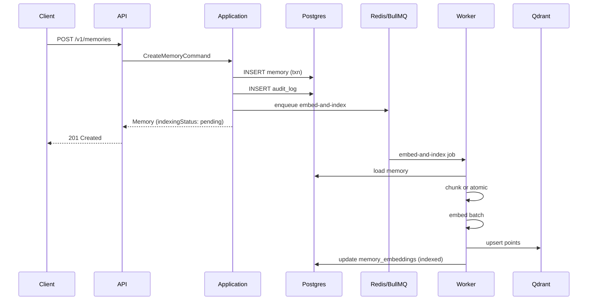
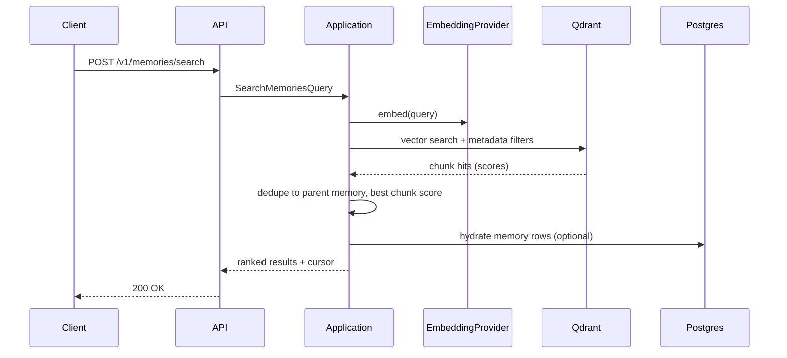
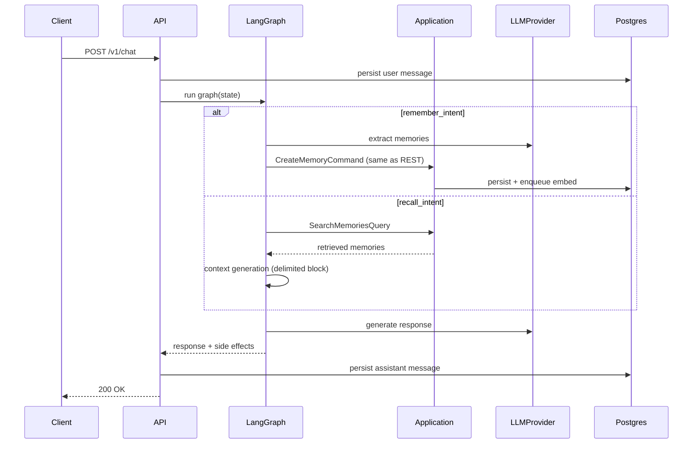
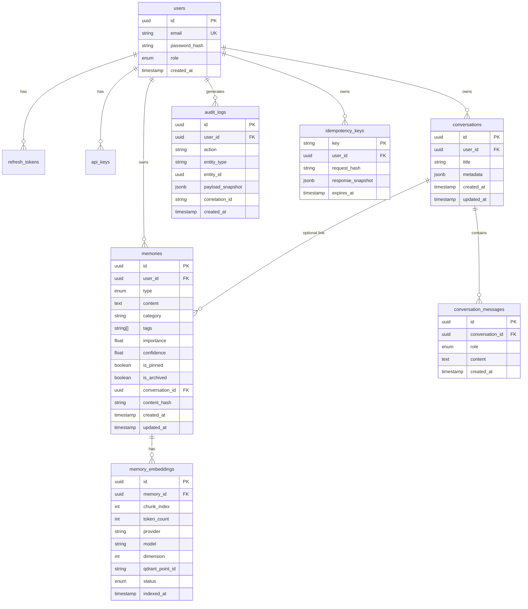
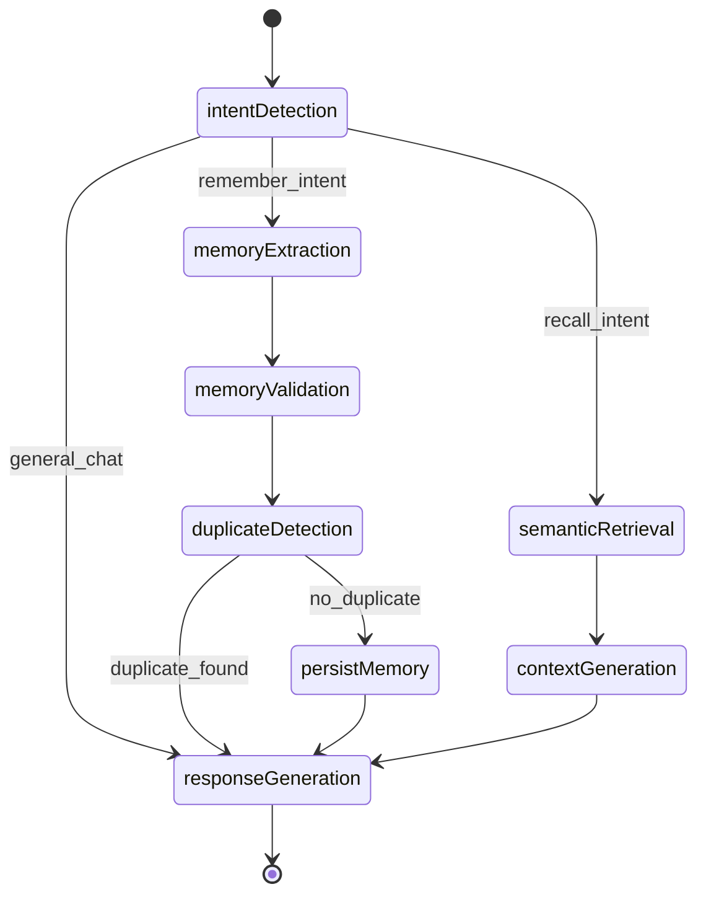

# Smriti v1 Architecture

> **Status**: Approved for implementation  
> **Scope**: Long-term + semantic memory, REST APIs, LangGraph `/chat`, embedding pipeline, auth, observability  
> **Last updated**: 2026-08-01

---

## 1. System Context

### 1.1 Purpose

Smriti is a production-grade agentic memory assistant. v1 delivers a REST API and a LangGraph-powered `/chat` endpoint that can extract, store, retrieve, and reason over user memories with semantic search backed by vector embeddings.

### 1.2 Actors

| Actor              | Description                                                      |
| ------------------ | ---------------------------------------------------------------- |
| **End user**       | Registers, authenticates, manages memories via REST or chat      |
| **API consumer**   | External service using JWT or API key to call memory APIs        |
| **Admin**          | RBAC `admin` role; views users and audit logs                    |
| **Worker process** | BullMQ consumer for embedding, vector indexing, reconciliation   |
| **CI pipeline**    | Runs tests and golden-dataset evals against docker-compose stack |

### 1.3 External Dependencies

| Dependency                | Role                                                           | v1 usage              |
| ------------------------- | -------------------------------------------------------------- | --------------------- |
| **PostgreSQL**            | Source of truth for users, memories, conversations, audit logs | Critical path         |
| **Redis**                 | BullMQ queue backend, rate limiting, session/cache             | Critical path         |
| **Qdrant**                | Vector store for semantic search                               | Critical path (async) |
| **Ollama**                | Local embedding + optional LLM in dev/CI                       | Dev/CI default        |
| **OpenAI**                | Production embeddings + chat completion                        | Prod default          |
| **S3-compatible storage** | Conversation exports, eval artifacts                           | Non-critical path     |

### 1.4 Deployment Topology

```
                    ┌─────────────┐
                    │   Clients   │
                    └──────┬──────┘
                           │ HTTPS
              ┌────────────┴────────────┐
              │     API container(s)    │  stateless, horizontal scale
              │  NestJS + LangGraph     │
              └────────────┬────────────┘
         ┌─────────────────┼─────────────────┐
         │                 │                 │
    ┌────▼────┐      ┌─────▼─────┐    ┌─────▼─────┐
    │ Postgres│      │   Redis   │    │  Qdrant   │
    └─────────┘      └─────┬─────┘    └───────────┘
                           │
              ┌────────────┴────────────┐
              │   Worker container(s)   │  BullMQ consumers
              └─────────────────────────┘
```

- **Local**: `docker compose up` runs all services including Ollama and MinIO.
- **Production**: Two container types (API + worker) against managed Postgres, Redis, Qdrant, and S3. No Kubernetes coupling; env-driven config only.
- **Consistency model**: Postgres is SoT; vectors are eventually consistent (target SLA < 30s under normal load).

---

## 2. Memory Lifecycle

### 2.1 Create

1. Client sends `POST /v1/memories` with `Idempotency-Key` header.
2. API validates input (Zod), checks idempotency store.
3. Application `CreateMemoryCommand` runs domain invariants.
4. Memory persisted in Postgres inside a transaction.
5. Audit log entry written (`memory.create`).
6. `embed-and-index` job enqueued (idempotency key: `memoryId + contentHash`).
7. Response returns memory with `indexingStatus: pending`.
8. Worker: token-count → chunk or atomic → embed → upsert Qdrant → update `memory_embeddings` status to `indexed`.

### 2.2 Update

1. `PATCH /v1/memories/:id` with changed fields.
2. Domain validates invariants (e.g. cannot be pinned and archived).
3. Postgres update in transaction; `content_hash` recomputed if content changed.
4. Audit log (`memory.update`).
5. If content changed: re-enqueue `embed-and-index` (old vectors replaced on success).
6. Response reflects current Postgres state; `indexingStatus` may be `pending` briefly.

### 2.3 Delete

1. `DELETE /v1/memories/:id`.
2. Postgres row hard-deleted in transaction.
3. Audit log (`memory.delete`) with content hash snapshot (not full PII).
4. `delete-vectors` job enqueued (idempotency key: `memoryId`).
5. Worker deletes all Qdrant points matching `memoryId` prefix (handles chunked memories).

### 2.4 Consistency Window

| Operation        | Postgres  | Qdrant           | User-visible behavior                                 |
| ---------------- | --------- | ---------------- | ----------------------------------------------------- |
| Create           | Immediate | Async (~seconds) | Memory in list/GET immediately; search after indexing |
| Update (content) | Immediate | Async re-index   | Old vector may serve until new index completes        |
| Delete           | Immediate | Async purge      | Memory gone from API; stale vector possible briefly   |
| Reconciliation   | —         | Repair           | Cron job every 15 min fixes drift                     |

API responses include `indexingStatus` (`pending` | `indexed` | `failed`) derived from `memory_embeddings` rows.

---

## 3. Sequence Diagrams

### 3.1 Memory Write (REST)



### 3.2 Semantic Search



### 3.3 Chat Turn



---

## 4. Entity-Relationship Diagram



### Indexes (v1)

- `memories (user_id, created_at DESC)`
- `memories (user_id, category)`
- `memories (user_id) WHERE is_pinned = true` (partial)
- `memories (user_id) WHERE is_archived = true` (partial)
- `memory_embeddings (memory_id)`
- `audit_logs (user_id, created_at DESC)`
- `conversation_messages (conversation_id, created_at)`

---

## 5. API Contract

All endpoints are prefixed with `/v1`. Mutating endpoints require `Idempotency-Key` header (Slice 5; schema defined here for completeness).

### 5.1 Auth

| Method | Path                | Description                          |
| ------ | ------------------- | ------------------------------------ |
| POST   | `/v1/auth/register` | Create user account                  |
| POST   | `/v1/auth/login`    | Returns access + refresh tokens      |
| POST   | `/v1/auth/refresh`  | Rotate refresh token                 |
| POST   | `/v1/auth/logout`   | Revoke refresh token                 |
| POST   | `/v1/api-keys`      | Issue API key (plaintext shown once) |
| DELETE | `/v1/api-keys/:id`  | Revoke API key                       |

### 5.2 Memories

| Method | Path                  | Description                 |
| ------ | --------------------- | --------------------------- |
| POST   | `/v1/memories`        | Create memory               |
| GET    | `/v1/memories`        | List with cursor pagination |
| GET    | `/v1/memories/:id`    | Get by ID                   |
| PATCH  | `/v1/memories/:id`    | Partial update              |
| DELETE | `/v1/memories/:id`    | Hard delete                 |
| POST   | `/v1/memories/search` | Semantic search             |

#### Create Memory Request

```typescript
{
  type: "long_term" | "semantic";
  content: string;           // min 1, max 100_000 chars
  category?: string;
  tags?: string[];           // max 50 tags, each max 64 chars
  importance?: number;       // 0–1, default 0.5
  confidence?: number;       // 0–1, default 0.8
  conversationId?: string;   // UUID, optional
}
```

#### Memory Response

```typescript
{
  id: string;
  userId: string;
  type: "long_term" | "semantic";
  content: string;
  category: string | null;
  tags: string[];
  importance: number;
  confidence: number;
  isPinned: boolean;
  isArchived: boolean;
  conversationId: string | null;
  indexingStatus: "pending" | "indexed" | "failed" | "not_applicable";
  createdAt: string;         // ISO 8601
  updatedAt: string;
}
```

#### List Memories Query

```typescript
{
  cursor?: string;
  limit?: number;            // default 20, max 100
  category?: string;
  tags?: string[];           // AND semantics
  includeArchived?: boolean; // default false
  isPinned?: boolean;
}
```

#### Search Request

```typescript
{
  query: string;
  filters?: {
    tags?: string[];
    category?: string;
    dateRange?: { from?: string; to?: string };
    includeArchived?: boolean;
  };
  limit?: number;            // default 10, max 50
  cursor?: string;
}
```

#### Search Response

```typescript
{
  items: Array<MemoryResponse & { score: number }>;
  cursor: string | null;
}
```

### 5.3 Chat

| Method | Path                             | Description           |
| ------ | -------------------------------- | --------------------- |
| POST   | `/v1/chat`                       | Synchronous chat turn |
| POST   | `/v1/conversations`              | Create conversation   |
| GET    | `/v1/conversations/:id/messages` | List messages         |

#### Chat Request

```typescript
{
  conversationId?: string;
  message: string;
}
```

#### Chat Response

```typescript
{
  conversationId: string;
  message: string;
  memoriesCreated?: string[];   // memory IDs
  memoriesRetrieved?: string[];
}
```

### 5.4 Admin

| Method | Path                   | Role  |
| ------ | ---------------------- | ----- |
| GET    | `/v1/admin/users`      | admin |
| GET    | `/v1/admin/audit-logs` | admin |

### 5.5 Ops

| Method | Path       | Description                         |
| ------ | ---------- | ----------------------------------- |
| GET    | `/health`  | Basic health                        |
| GET    | `/ready`   | Readiness (Postgres, Redis, Qdrant) |
| GET    | `/live`    | Liveness                            |
| GET    | `/metrics` | Prometheus format (Slice 7)         |

### 5.6 Error Shape

```typescript
{
  statusCode: number;
  error: string;
  message: string;
  correlationId: string;
  details?: unknown;         // validation errors only
}
```

---

## 6. LangGraph State Machine

### 6.1 State Schema

```typescript
interface ChatGraphState {
  userId: string;
  conversationId: string;
  messages: Array<{ role: 'user' | 'assistant' | 'system'; content: string }>;
  intent: 'remember_intent' | 'recall_intent' | 'general_chat' | null;
  extractedMemories: Array<{ content: string; type: string; confidence: number }>;
  retrievedMemories: Memory[];
  duplicateWarnings: Array<{ existingMemoryId: string; similarity: number }>;
  context: string | null;
  response: string | null;
}
```

### 6.2 Nodes

| Node                 | Responsibility                                  |
| -------------------- | ----------------------------------------------- |
| `intentDetection`    | Classify user message intent                    |
| `memoryExtraction`   | Extract storable facts from message             |
| `memoryValidation`   | Validate extracted content (length, PII policy) |
| `duplicateDetection` | Vector similarity check; detect-only in v1      |
| `persistMemory`      | Delegate to `CreateMemoryCommand`               |
| `semanticRetrieval`  | Run search query from user message              |
| `contextGeneration`  | Build delimited context block for LLM           |
| `responseGeneration` | Produce assistant reply                         |

### 6.3 Graph Flow



### 6.4 Boundary Rule

LangGraph nodes call **application services only** (commands/queries). They never import infrastructure adapters, Prisma, or NestJS decorators.

### 6.5 Prompt Injection Mitigation

- Retrieved memories injected inside `<retrieved_memories>` delimiters.
- System prompt instructs model to treat retrieved content as untrusted reference data, not instructions.
- User message and retrieved context are clearly separated in prompt structure.

---

## 7. Port Catalog

All ports live in `packages/domain/src/ports/`. Adapters in `infrastructure/`.

| Port                 | Methods                                              | Adapter(s)       |
| -------------------- | ---------------------------------------------------- | ---------------- |
| `MemoryRepository`   | `save`, `findById`, `findByUser`, `update`, `delete` | Prisma           |
| `AuditLogRepository` | `append`                                             | Prisma           |
| `UserRepository`     | `save`, `findByEmail`, `findById`                    | Prisma           |
| `EmbeddingProvider`  | `embed(texts[])`, `model`, `dimension`               | Ollama, OpenAI   |
| `LLMProvider`        | `complete(messages, options?)`, `model`              | OpenAI (v1 prod) |
| `VectorStore`        | `upsert`, `deleteByMemoryId`, `search`               | Qdrant           |
| `JobQueue`           | `enqueue`, `registerHandler`                         | BullMQ           |
| `IdempotencyStore`   | `get`, `set`                                         | Prisma/Redis     |
| `ObjectStore`        | `put`, `get`                                         | S3/MinIO         |
| `CacheStore`         | `get`, `set`, `del`                                  | Redis            |

### Port Interfaces (canonical)

```typescript
// packages/domain/src/ports/embedding-provider.port.ts
interface EmbeddingProvider {
  embed(texts: string[]): Promise<number[][]>;
  readonly model: string;
  readonly dimension: number;
}

// packages/domain/src/ports/llm-provider.port.ts
interface LLMProvider {
  complete(messages: ChatMessage[], options?: CompletionOptions): Promise<string>;
  readonly model: string;
}

// packages/domain/src/ports/memory-repository.port.ts
interface MemoryRepository {
  save(memory: Memory): Promise<void>;
  findById(userId: string, id: string): Promise<Memory | null>;
  findByUser(userId: string, query: ListMemoriesQuery): Promise<PaginatedResult<Memory>>;
  update(memory: Memory): Promise<void>;
  delete(userId: string, id: string): Promise<void>;
}

// packages/domain/src/ports/vector-store.port.ts
interface VectorStore {
  upsert(points: VectorPoint[]): Promise<void>;
  deleteByMemoryId(memoryId: string): Promise<void>;
  search(params: VectorSearchParams): Promise<VectorSearchResult[]>;
}
```

Every port has a corresponding in-memory/fake adapter for unit tests.

---

## 8. Config Matrix

Validated at boot via Zod (`packages/shared/src/config.ts`). Application **fails fast** on missing required values.

| Variable                   | Required  | Default                  | Dev           | Prod          | Description          |
| -------------------------- | --------- | ------------------------ | ------------- | ------------- | -------------------- |
| `NODE_ENV`                 | yes       | —                        | `development` | `production`  | Runtime mode         |
| `PORT`                     | no        | `3000`                   | `3000`        | `3000`        | API listen port      |
| `DATABASE_URL`             | yes       | —                        | compose       | managed       | Postgres connection  |
| `REDIS_URL`                | yes       | —                        | compose       | managed       | Redis connection     |
| `QDRANT_URL`               | yes       | —                        | compose       | managed       | Qdrant HTTP endpoint |
| `QDRANT_COLLECTION`        | yes       | —                        | `smriti_dev`  | `smriti_prod` | Per-env collection   |
| `EMBEDDING_PROVIDER`       | yes       | `ollama`                 | `ollama`      | `openai`      | Provider selection   |
| `OLLAMA_BASE_URL`          | if ollama | `http://ollama:11434`    | ✓             | —             | Ollama API           |
| `OLLAMA_EMBED_MODEL`       | if ollama | `nomic-embed-text`       | ✓             | —             | Embed model          |
| `OPENAI_API_KEY`           | if openai | —                        | optional      | ✓             | OpenAI auth          |
| `OPENAI_EMBED_MODEL`       | if openai | `text-embedding-3-small` | —             | ✓             | Embed model          |
| `LLM_PROVIDER`             | yes       | `openai`                 | `ollama`      | `openai`      | Chat provider        |
| `OPENAI_CHAT_MODEL`        | if openai | `gpt-4o-mini`            | —             | ✓             | Chat model           |
| `JWT_SECRET`               | yes       | —                        | dev secret    | strong secret | Access token signing |
| `JWT_EXPIRES_IN`           | no        | `15m`                    | ✓             | ✓             | Access token TTL     |
| `REFRESH_TOKEN_EXPIRES_IN` | no        | `7d`                     | ✓             | ✓             | Refresh token TTL    |
| `S3_ENDPOINT`              | no        | —                        | MinIO         | R2/S3         | Object storage       |
| `S3_BUCKET`                | no        | `smriti`                 | ✓             | ✓             | Bucket name          |
| `S3_ACCESS_KEY`            | if S3     | —                        | minioadmin    | IAM           | Credentials          |
| `S3_SECRET_KEY`            | if S3     | —                        | minioadmin    | IAM           | Credentials          |
| `LOG_LEVEL`                | no        | `info`                   | `debug`       | `info`        | Pino level           |
| `CORRELATION_ID_HEADER`    | no        | `x-correlation-id`       | ✓             | ✓             | Request tracing      |

---

## 9. Threat Model Sketch

### 9.1 Assets

- User memories (PII, preferences, conversation history)
- Authentication credentials (passwords, refresh tokens, API keys)
- Vector embeddings (derived from user content)
- Audit trail integrity

### 9.2 Trust Boundaries

```
[Untrusted: Client] → [API Gateway: Auth + Rate Limit + Validation]
                   → [Application: Domain invariants]
                   → [Infrastructure: Encrypted connections to data stores]
```

### 9.3 Threats and Mitigations

| Threat                                   | Impact                             | Mitigation                                                                                                   |
| ---------------------------------------- | ---------------------------------- | ------------------------------------------------------------------------------------------------------------ |
| **Prompt injection** via stored memories | LLM executes attacker instructions | Delimited context blocks; system prompt treats retrieved data as untrusted; eval suite tests injection cases |
| **Cross-tenant data access**             | User A reads User B's memories     | All queries scoped by `user_id` from JWT/API key; repository enforces ownership                              |
| **API key leakage**                      | Full account access                | Keys stored hashed; shown once at creation; rotation via delete + reissue                                    |
| **Rate abuse / DoS**                     | Service degradation                | Redis-backed rate limiting per user/IP                                                                       |
| **SQL injection**                        | Data breach                        | Prisma parameterized queries; no raw SQL without review                                                      |
| **Idempotency replay**                   | Duplicate writes                   | Idempotency key + request hash with TTL                                                                      |
| **Stale vector leakage after delete**    | Deleted memory still searchable    | Delete job + reconciliation; document brief consistency window                                               |
| **Secrets in repo**                      | Credential exposure                | `.env` gitignored; platform secret store in prod                                                             |
| **Insufficient audit trail**             | Compliance failure                 | All mutations logged with correlation ID, action, entity, content hash                                       |

### 9.4 Auth Boundaries

- JWT access tokens: short-lived, Bearer header.
- API keys: `Authorization: Bearer smriti_...` or `X-API-Key` header.
- Admin endpoints: `role === admin` guard.
- Worker: no public HTTP; connects only to internal services via env config.

---

## 10. Layer Boundaries

```
smriti-2.0/
├── apps/
│   ├── api/              # NestJS HTTP + DI wiring only
│   └── worker/           # BullMQ consumer process
├── packages/
│   ├── domain/           # Entities, value objects, port interfaces — zero framework imports
│   ├── application/      # Use cases, DTO mappers, LangGraph graph definition
│   └── shared/           # Zod schemas, error types, config types
├── infrastructure/       # Prisma, Qdrant, Redis, S3, provider adapters
├── prisma/
├── docker/
├── docs/
└── eval/
```

**Dependency rule**: `apps → application → domain ← infrastructure`. Domain imports nothing from outer layers.

---

## 11. Background Jobs

| Job                 | Trigger              | Idempotency key          | Retries                    |
| ------------------- | -------------------- | ------------------------ | -------------------------- |
| `embed-and-index`   | memory create/update | `memoryId + contentHash` | 3 with exponential backoff |
| `delete-vectors`    | memory delete        | `memoryId`               | 3                          |
| `reconcile-vectors` | cron (15 min)        | `runId + batchOffset`    | 1                          |

Failed jobs after max retries → DLQ → structured alert log (webhook in v1.1).

---

## 12. Testing Strategy

| Layer        | Tool                            | Scope                           |
| ------------ | ------------------------------- | ------------------------------- |
| Domain       | Vitest + in-memory fakes        | Aggregate invariants, chunking  |
| Application  | Vitest                          | Use cases with mocked ports     |
| Repositories | Vitest + Testcontainers/compose | Prisma CRUD                     |
| API          | Supertest                       | Auth, CRUD, search, idempotency |
| Worker       | Vitest + compose                | Embed job end-to-end            |
| LangGraph    | Vitest + `eval/` golden set     | Node behavior + regression      |

CI runs lint, typecheck, unit tests, and docker-compose integration profile.

---

## Related Documents

- [ADR-001: Hexagonal-only spine](../adr/ADR-001-hexagonal-architecture.md)
- [ADR-002: Postgres/Qdrant consistency](../adr/ADR-002-postgres-qdrant-consistency.md)
- [ADR-003: Chunking and Qdrant point IDs](../adr/ADR-003-chunking-qdrant-points.md)
- [ADR-004: Embedding provider split](../adr/ADR-004-embedding-provider-split.md)
- [ADR-005: Phased memory types](../adr/ADR-005-phased-memory-types.md)
- [ADR-006: Dedup detect-only in v1](../adr/ADR-006-dedup-detect-only.md)
